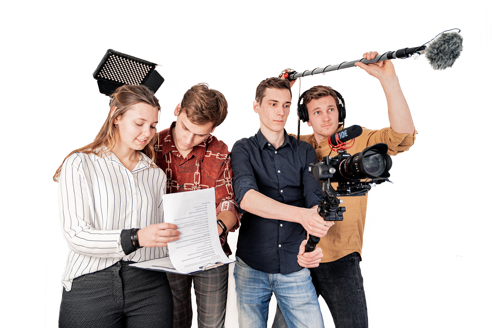

import Youtube from "../components/Youtube.astro";

In 2021 vierde de christelijke studentenvereniging C.S.R. Delft haar 60-jarig bestaan. Ter gelegenheid van dit twaalfde lustrum heeft een aantal leden een speelfilm van 40 minuten gemaakt. "Een Ongewenste Lift" is een actie-komedie door en voor leden. Aan dit project werkten vijf acteurs en 30 figuranten mee. Verder hebben verschillende mensen zich ingezet voor make-up en kleding, het animeren en renderen van de openingsanimatie, het componeren van muziek voor de openingsanimatie en het maken van pr-materiaal. Zelf maakte ik deel uit van het kernteam van vier mensen dat dit project organiseerde. Met ons vieren hebben we bijna een jaar lang gewerkt aan het schrijven van het script, uitschrijven van audities, testscènes filmen, tien dagen opnemen en maanden editen.

Trailer:

<Youtube titel="Trailer" youtubeId="SfK4_fCNvn0" />

Film:

<Youtube titel="Film" youtubeId="6LUGK_lQm-Y" />

Documentaire: Achter de schermen van Een ongewenste lift.

<Youtube titel="Documentaire" youtubeId="2xxTYNTTsq4" />
